# 🛒 E-commerce Data Engineering Pipeline

An end-to-end data engineering project that ingests live e-commerce API data, processes it using Apache Spark, stores it in PostgreSQL and S3, models it with DBT, and orchestrates the workflow using Apache Airflow — all fully containerized using Docker.

---

## 🚀 Tech Stack

| Layer        | Technology         |
|-------------|--------------------|
| Ingestion    | Python, REST API   |
| Storage      | PostgreSQL, Amazon S3 |
| Processing   | Apache Spark       |
| Transformation | DBT              |
| Orchestration | Apache Airflow    |
| Infrastructure | Docker + Docker Compose |

---

## 🧱 Project Architecture

```mermaid
graph TD
  A[Live API &#40;JSON&#41;] --> B[Ingestion Script &#40;Python&#41;]
  B --> C[PostgreSQL &#40;raw tables&#41;]
  C --> D[S3 Upload Script]
  D --> E[S3 &#40;raw zone&#41;]
  E --> F[Spark Job in Docker]
  F --> G[S3 &#40;processed zone - Parquet&#41;]
  G --> H[Loader Script &#40;Python&#41;]
  H --> I[PostgreSQL &#40;staging&#41;]
  I --> J[DBT Models]
  J --> K[PostgreSQL &#40;marts&#41;]
  K --> L[Airflow DAG Orchestration]
```



---

## 📂 Project Structure

```
ecommerce_pipeline/
├── airflow/                 # Airflow DAGs and config
│   └── dags/
│       └── fakestore_pipeline_dag.py
├── pg-ingestion/               # API ingestion scripts
│   └── api_data.py
├── pg-loader/                 # Load Parquet into PostgreSQL
│   └── push-to-s3.py
│   └── s3_to_postgres.py
├── spark_job/              # Spark transformations
│   └── spark_process_orders.py
├── dbt_fakestore/           # DBT project directory
│   └── models/
├── docker/                  # Docker setup (Dockerfile, spark-submit.sh)
├── .env                     # Secrets (not committed)
├── requirements.txt
├── docker-compose.yml
└── README.md
```

---

## 🛠️ Setup Instructions

### 1. Clone the Repository


### 2. Add Environment Variables

Create a `.env` file for AWS credentials:

```env
AWS_ACCESS_KEY_ID=your_access_key
AWS_SECRET_ACCESS_KEY=your_secret_key
```

> ✅ This file is ignored by `.gitignore`

---

### 3. Start Services with Docker Compose

```bash
docker compose up -d --build
```

---

### 4. Access Services

| Tool      | URL                  | Credentials           |
|-----------|----------------------|------------------------|
| Airflow   | http://localhost:8080 | `airflow / airflow`   |
| Postgres  | localhost:5432       | `postgres / postgres` |

---

### 5. Trigger DAG in Airflow

```bash
docker compose exec webserver airflow dags trigger fakestore_pipeline
```

---

## 📊 DBT Models

- `customer_ltv`: Segments customers by total spend
- `top_products`: Identifies highest-grossing products

Run DBT models:

```bash
cd dbt_fakestore
dbt run
```

## 🧠 Learning Goals

✔ End-to-end orchestration  
✔ API ingestion + S3 storage  
✔ Spark for batch transformations  
✔ DBT for modeling and SQL engineering  
✔ Airflow for scheduling and dependency management  
✔ Docker for portability  

---
=======
